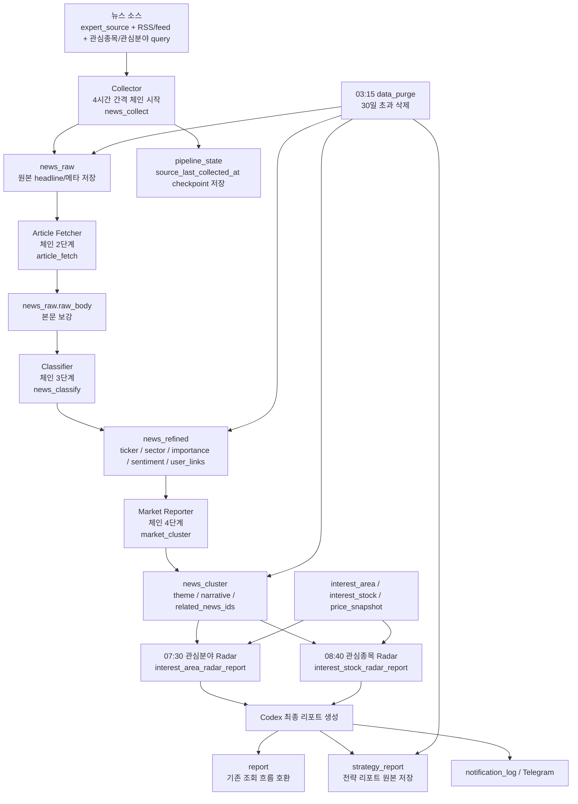

# Codex Pipeline 설계

## 1. 목표

Codex 파이프라인의 목적은 뉴스 원문을 그대로 나열하는 것이 아니라, 수집된 데이터를 단계적으로 정제해 사용자 맞춤 전략 리포트로 변환하는 것이다.

현재 최종 리포트는 2개 타입이다.

- `interest_area_radar`
- `interest_stock_radar`

## 2. 사용 중인 Skill

- `api-orchestrator`
- `final-investment-opinion`
- `interest-area-research-watch`
- `interest-area-radar`
- `interest-stock-radar`
- `price-alert-watch`

스케줄 타입별 skill 매핑:

- `manual_codex_analysis`: `codex_skills/final-investment-opinion/SKILL.md`
- `interest_area_research_watch`: `codex_skills/interest-area-research-watch/SKILL.md`
- `interest_area_radar_report`: `codex_skills/interest-area-radar/SKILL.md`
- `interest_stock_radar_report`: `codex_skills/interest-stock-radar/SKILL.md`

## 3. 5단계 파이프라인

### 단계별 데이터 계약

| 단계 | 입력 | 처리 | 출력 저장소 |
|---|---|---|---|
| Collector | `expert_source`, 기본 RSS/feed, 관심종목/관심분야 기반 query | 기사 headline과 메타를 정규화하고 중복을 제거한다 | `news_raw` |

기본 글로벌 소스 정책:
- 기본 글로벌 소스는 접근성과 본문 추출 가능성을 우선해 공식 RSS 중심으로 큐레이션한다.
- 현재 기본 축은 BBC, The Guardian, NPR, ABC News, Al Jazeera, Fortune, Forbes, Federal Reserve, ECB와 오건영 Facebook 보조 소스다.
- 관심종목/관심분야용 Google News query feed는 보조 입력으로 유지하되, 전역 backfill의 중심은 공식 RSS 소스에 둔다.
| Article Fetcher | `news_raw.url` | 기사 source URL에서 본문을 추출해 `raw_body`를 채운다 | `news_raw` |
| Classifier | `news_raw` | `title + raw_summary + raw_body` 기준으로 `tickers`, `sectors`, `importance`, `sentiment`, `user_links`를 추출한다 | `news_refined` |
| Market Reporter | `news_refined` | 관련 뉴스를 테마와 내러티브로 묶는다 | `news_cluster` |
| Personal Strategy Reporter | `news_cluster` + 사용자 컨텍스트 | 최종 레이더 리포트를 생성한다 | `report`, `strategy_report` |

### 정제와 분류의 차이

- `수집(Collector)`
  - 원본 source에서 headline과 메타를 가져온다.
  - 아직 기사 의미를 해석하지 않는다.
  - 결과는 원본 성격의 `news_raw`다.
- `본문 보강(Article Fetcher)`
  - `news_raw.url`에 접속해 기사 본문을 best-effort로 추출한다.
  - 추출된 본문은 `news_raw.raw_body`에 저장된다.
- `분류(Classifier)`
  - 수집된 기사 내용을 읽고 의미를 해석한다.
  - 입력은 `title + raw_summary + raw_body`다.
  - 종목, 섹터, 중요도, 감성, 사용자 연결 근거를 붙인다.
  - 결과는 해석된 데이터인 `news_refined`다.
- `클러스터(Market Reporter)`
  - 여러 `news_refined`를 하나의 테마/내러티브로 묶는다.
  - 결과는 “지금 시장에서 어떤 이야기들이 형성되는가”를 담은 `news_cluster`다.

## 4. 체인 실행 모델

- 기본 주기마다 `news_pipeline_chain`이 실행된다.
- 순서는 항상 `news_collect -> article_fetch -> news_classify -> market_cluster`다.
- 각 단계 상태는 `pipeline_state`에 기록된다.
- 서버가 중간에 재시작되면 `news_pipeline_resume`이 `pipeline_state`를 보고 멈춘 단계부터 재개한다.

보강 실행 규칙:

- `news_raw`가 오래되었으면 collect부터
- 미분류 `news_raw`가 남아 있으면 classify부터
- `news_refined`가 `news_cluster`보다 최신이면 cluster부터

## 5. 수집 기간과 checkpoint

- 최초 실행은 source별 최근 7일을 backfill 대상으로 본다.
- 이후 실행은 source별 `last_collected_at`보다 새로운 기사만 유지한다.
- checkpoint 저장 위치:
  - `pipeline_state.meta.source_last_collected_at`

이 방식은 외부 feed가 제공하는 범위 안에서 incremental 수집을 가능하게 한다.

## 6. 시간 주기와 발행 시각

- `news_pipeline_chain`: 4시간 간격
- `news_pipeline_resume`: 서버 재기동 직후 1회
- `interest_area_radar_report`: 매일 07:30 KST
- `interest_stock_radar_report`: 매일 08:40 KST
- `interest_area_research_watch`: 매일 09:00 KST
- `data_purge`: 매일 03:15 KST

## 7. 도식

## 8. 프론트 검증 흐름

백엔드 파이프라인은 프론트의 파이프라인 테이블 화면과 연결된다.

- `POST /api/pipeline/backfill`
- `GET /api/pipeline/news-raw`
- `GET /api/pipeline/news-refined`
- `GET /api/pipeline/news-cluster`
- `GET /api/pipeline/strategy-reports`
- `GET /api/pipeline/state`

사용자는 이 화면에서 실제로 뉴스가

`source -> news_raw -> news_refined -> news_cluster -> report`

로 변환되는 과정을 직접 확인할 수 있다.

## 9. 출력 규약

전략 리포트는 최소한 다음 필드를 가진다.

- `title`
- `markdown`
- `report_type`
- `decision_json`
- `major_signal_detected`
- `notification_summary`

현재 `report_type`:

- `interest_area_radar`
- `interest_stock_radar`

## 10. 실패 처리

- Codex timeout/non-zero exit는 실패로 기록한다.
- 실패해도 fallback 리포트를 만들 수 있다.
- 리포트 실패가 전체 파이프라인 저장을 막지 않게 한다.

## 11. 문서 운영

- skill 매핑, 단계 계약, 주기, checkpoint, 리포트 타입이 바뀌면 이 문서를 갱신한다.
추가 원칙:
- `news_raw`는 원본 기사 저장소다. 제목, 링크, 원문 요약, 본문을 보관한다.
- `news_refined`는 분류와 요약이 끝난 정제 데이터다. 최종 전략 리포트는 원칙적으로 이 정제 데이터와 `news_cluster`를 우선 활용한다.
- `raw_body`는 정제 단계의 입력 품질을 높이기 위한 용도이며, 최종 리포트는 원문 본문을 그대로 소비하기보다 정제된 요약/태그/클러스터를 사용한다.
